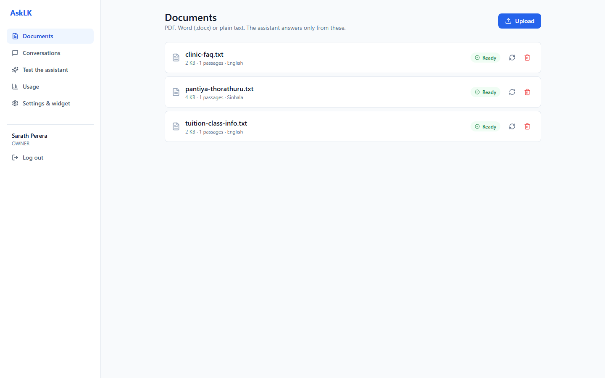
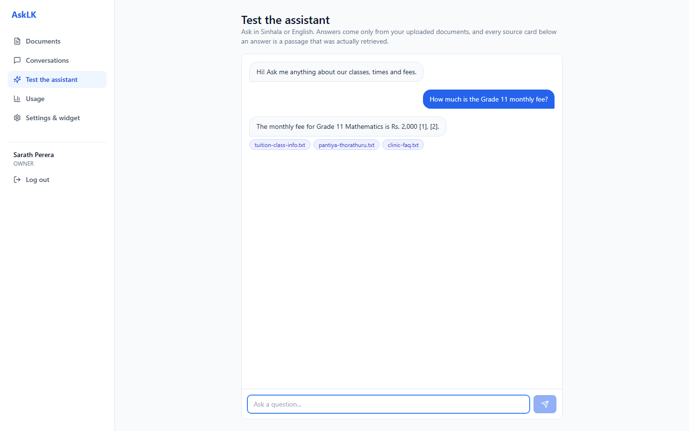
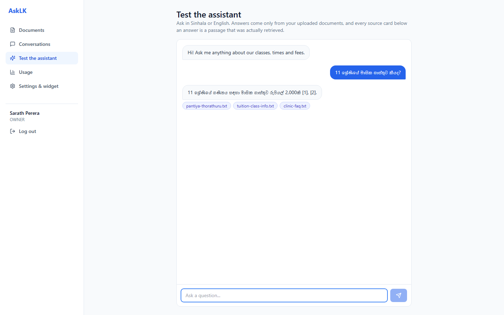
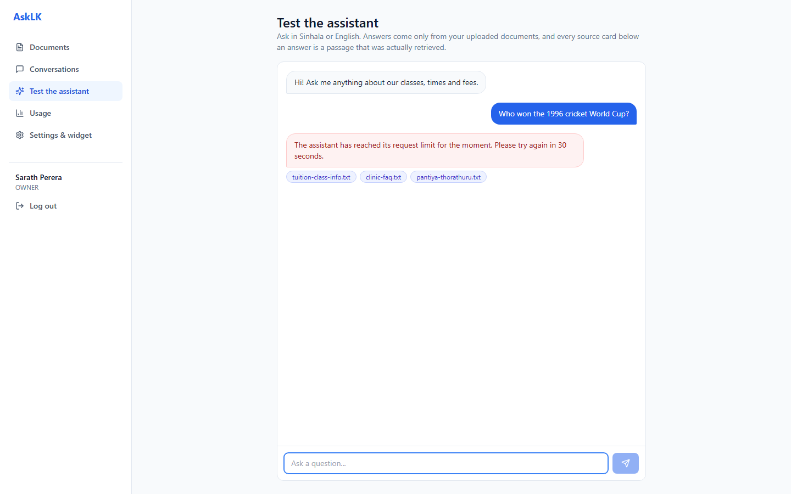
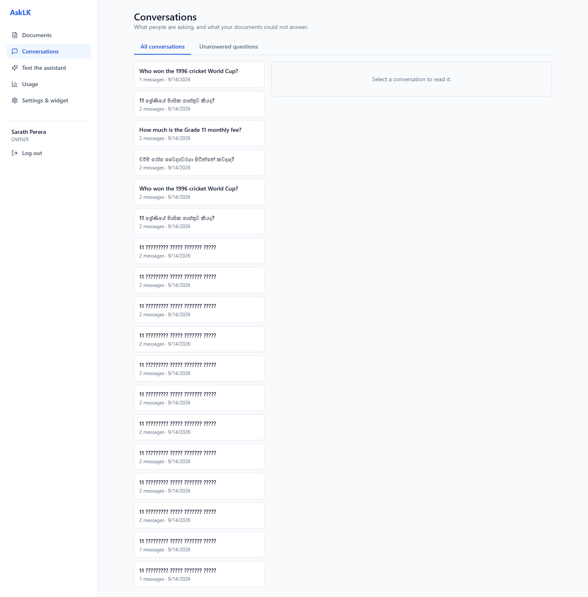
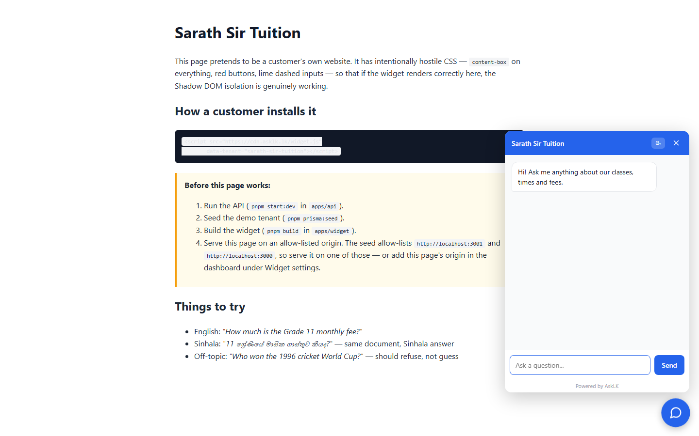
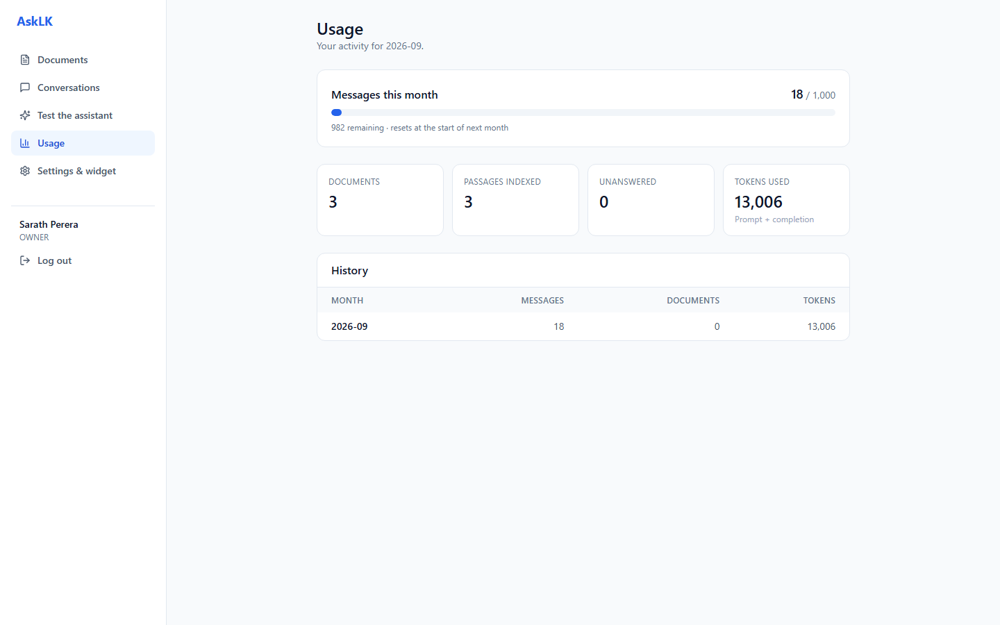

# AskLK — White-label Bilingual AI Assistant (Multi-tenant RAG) · Showcase

> **This is a public showcase of a private product.** The full source is private (it is being built as a SaaS).
> This repo contains the architecture, RAG, database and security design, selected code excerpts, and a demo,
> so that recruiters and clients can evaluate the concept and the engineering quality.
> Full read-only source access can be granted on request for interviews. See [LICENSE](LICENSE).

**Author:** Janindu Gayanga · [iamjanindu.com](https://iamjanindu.com) · [LinkedIn](https://www.linkedin.com/in/janindu-gayanga-02ba60217) · janindugayanga10@gmail.com

---

## What it is

AskLK is a white-label AI assistant any Sri Lankan organisation can point at its own documents.
A tuition teacher uploads notes and past papers; students ask questions and get answers. A clinic uploads
its FAQ; patients ask about services. A company uploads its policies; staff ask about leave.

**Ask in Sinhala, get Sinhala. Ask in English, get English** — even when the source document is in the
other language. Answers are grounded in the customer's own documents, with citations, and the assistant
refuses rather than guessing when the documents do not contain the answer.

It ships as a dashboard and as a **14.1KB** embeddable widget (4.4KB gzipped) that drops into any
customer website with one `<script>` tag.

**Live demo:** _coming soon_ · **Demo video (3 min):** _coming soon_

## Features

| Area | What is built |
|---|---|
| Tenants | Multi-tenant from the first row — `tenantId` on every owned table and in every `WHERE` clause, always taken from the verified JWT |
| Documents | PDF / Word / text upload, queued ingestion, extraction → chunking → embedding, live status and human-readable failure reasons |
| Retrieval | **Hybrid search in one SQL query**: pgvector cosine + PostgreSQL full-text, merged with Reciprocal Rank Fusion |
| Answering | Streaming answers over SSE, inline citations, source cards rendered from retrieved rows |
| Anti-hallucination | Four layers — similarity floor before the model is called, prompt constraints, citation validation, row-derived sources |
| Bilingual | Sinhala ⇄ English across the question, the document and the answer, with a language-aware token estimate |
| Widget | Vanilla TypeScript, Shadow DOM isolation, streaming, source chips, SI/EN toggle, origin allow-list |
| Auth & security | JWT access + refresh rotation with reuse detection, RBAC (owner / admin), rate limiting, per-tenant quotas |
| Platform | Docker Compose, GitHub Actions CI (typecheck · unit · integration · E2E), Swagger/OpenAPI |

## Stack

- **API:** NestJS 10 · TypeScript · Prisma · PostgreSQL 16 + **pgvector** · Redis · Swagger/OpenAPI · Jest
- **AI:** Google Gemini free tier — `gemini-2.5-flash` generation, `gemini-embedding-001` embeddings at **768d**
- **Web:** Next.js 14 App Router · TanStack Query · Zustand · Tailwind · lucide-react
- **Widget:** Vanilla TypeScript · Shadow DOM · no framework — 14.1KB raw / 4.4KB gzipped
- **Infra:** Docker · docker-compose · GitHub Actions
- **Testing:** Jest (80 unit tests) · integration against a real pgvector database · Playwright E2E

## Architecture

```
   ┌──────────────────┐   ┌──────────────────────┐
   │  Widget (14KB)   │   │  Next.js 14  :3001   │
   │  any customer    │   │  dashboard + chat    │
   │  site, Shadow DOM│   │  TanStack · Zustand  │
   └────────┬─────────┘   └──────────┬───────────┘
            │      REST + SSE        │
            └───────────┬────────────┘
                        ▼
            ┌───────────────────────────┐
            │   NestJS API      :3000   │
            │   auth · RBAC · tenants   │
            │   RAG pipeline · SSE      │
            └──┬─────────┬──────────┬───┘
               │         │          │
               ▼         ▼          ▼
   ┌──────────────┐ ┌─────────┐ ┌──────────────┐
   │ PostgreSQL   │ │  Redis  │ │ Gemini API   │
   │ + pgvector   │ │ queue   │ │ 2.5-flash    │
   │ chunks·FTS   │ │ cache   │ │ embedding-001│
   │ tenants·docs │ │ limits  │ │              │
   └──────────────┘ └────┬────┘ └──────────────┘
                         │ BRPOP
                    ┌────▼─────────────┐
                    │ Ingestion worker │
                    │ extract·chunk·   │
                    │ embed            │
                    └──────────────────┘
```

Full write-ups: [docs/01-ARCHITECTURE.md](docs/01-ARCHITECTURE.md) · [docs/02-RAG-EXPLAINED.md](docs/02-RAG-EXPLAINED.md) · [docs/03-DATABASE.md](docs/03-DATABASE.md) · [docs/04-SECURITY.md](docs/04-SECURITY.md)

> `02-RAG-EXPLAINED.md` is the one to read if you only read one: RAG in plain words, embeddings, chunking,
> hybrid search and RRF, the anti-hallucination layers, and how bilingual answering actually works.

## Code excerpts (read-only)

| File | Why it is here |
|---|---|
| [samples/rag-hybrid-search/fusion.ts](samples/rag-hybrid-search/fusion.ts) | Reciprocal Rank Fusion — merging two ranked lists whose scores cannot be compared, and why `k = 60` |
| [samples/rag-hybrid-search/fusion.spec.ts](samples/rag-hybrid-search/fusion.spec.ts) | Property tests, including the central one: rank 3 in both lists beats rank 1 in only one |
| [samples/rag-hybrid-search/retrieval.service.ts](samples/rag-hybrid-search/retrieval.service.ts) | The two search arms in raw parameterised SQL, with tenant isolation **inside** the `WHERE` clause |
| [samples/rag-citations/citations.ts](samples/rag-citations/citations.ts) | Anti-hallucination: the similarity floor, and citation validation that strips invented markers |
| [samples/rag-citations/citations.spec.ts](samples/rag-citations/citations.spec.ts) | Tested against how models actually misbehave — invented indices, mixed `[1, 9]` groups, Sinhala answers |
| [samples/rag-chunking/chunking.ts](samples/rag-chunking/chunking.ts) | The chunker, and a bilingual token estimate. **This file had a real bug a test caught** |
| [samples/rag-chunking/chunking.spec.ts](samples/rag-chunking/chunking.spec.ts) | The tests that caught the overlap bug before a single document was ingested |
| [docs/docker-compose.reference.yml](docs/docker-compose.reference.yml) | How the services are wired locally |

## Screenshots

| | |
|---|---|
| **Documents** — upload, live ingestion status, failure reasons<br> | **Test console** — streaming answers with source chips<br> |
| **Bilingual** — Sinhala question, English document, Sinhala answer<br> | **Citations** — inline markers and the passages behind them<br> |
| **Refusal** — no answer in the corpus, so it refuses instead of guessing<br> | **Unanswered questions** — the gaps in your documents<br> |
| **Widget on a customer site** — Shadow DOM, 14KB<br> | **Usage & quota**<br> |

## The interesting problems

**One datastore, not two.** The embeddings live in PostgreSQL via pgvector rather than a dedicated vector
database. That means a single SQL statement combines the tenant pre-filter, the document-status filter and
the vector similarity search — and chunks stay transactionally consistent with the documents they came
from. A standalone vector DB would put the filter in one system and the data in another, and re-ingesting
a document would stop being atomic.

**Hybrid retrieval with Reciprocal Rank Fusion.** Vector search finds passages that *mean* the same thing
— which is what lets a Sinhala question match an English passage at all. Full-text search finds passages
containing the same *words*, which embeddings are systematically bad at for rare exact tokens like
"G.C.E. A/L 2026" or a phone number. The two are merged by rank, not score, because cosine similarity in
[-1,1] and an unbounded `ts_rank` cannot be meaningfully added. A document ranked 3rd in **both** lists
beats one ranked 1st in only one.

**Four layers of anti-hallucination.** A similarity floor below which the bot refuses *before the model is
ever called* — that both prevents the wrong answer and saves the most expensive call in the pipeline.
Prompt constraints. Citation validation that strips any marker pointing at a passage that was never
retrieved. And source cards rendered from the retrieved **rows**, never parsed out of the model's text —
so an invented citation cannot manufacture a source.

**Tenant isolation in the WHERE clause.** Every tenant-owned row carries `tenantId`, every query filters on
it in SQL, and the value always comes from the verified JWT — never from a request body. An integration
test seeds two tenants and asserts that tenant A asking a question worded to match tenant B's document
*exactly* retrieves nothing of B's.

**768 dimensions, not 3072.** `gemini-embedding-001` returns 3072 by default, but pgvector's HNSW and
IVFFlat indexes cap at 2000 — a 3072d column can be stored and never indexed, so every query would
sequentially scan every chunk. The model is Matryoshka-trained, so a 768d output keeps almost all the
retrieval quality at a quarter of the storage.

**A chunker bug a test caught.** An overlap tail added to a paragraph that already filled the chunk pushed
every chunk over target. Nobody would have noticed from the output — the answers would simply have been
slightly worse, forever. A unit test caught it before a single document was ever ingested, which is the
argument for testing pure logic that has no visible failure mode.

## Status & roadmap

MVP complete — 23 API routes, hybrid retrieval, the four anti-hallucination layers, the Next.js dashboard,
the embeddable widget, 7 guides in both English and Sinhala, and CI across all three apps
(typecheck · unit · integration · E2E).

Next: OCR for scanned PDFs (they currently fail with a clear message rather than silently indexing
nothing), email verification and password reset, per-tenant embedding model selection, and a paid-tier
billing story.

## Access to full source

Interviewers / hiring managers: email me and I will add you as a **read-only collaborator** on the private repo for the
duration of the process.
